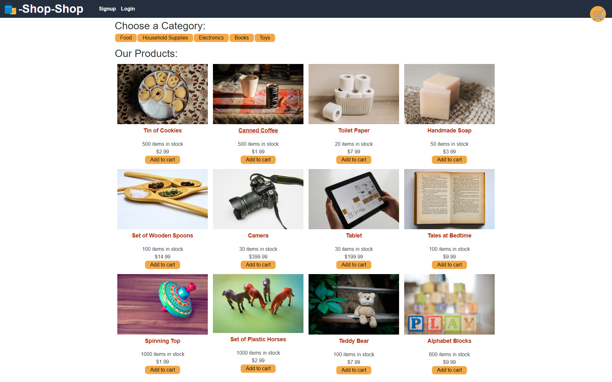

# Shop-Shop Redux
## Description


<br/>
Shop-Shop is an online E-commerce website built using React Redux tools. It allows users to shop around, add items to their cart, and checkout using Stripe.

<br/>
<br/>

[](https://opensource.org/licenses/MIT)

**Languages and Technologies Used:** 
- JavaScript ES6
- React
- Node.js
- Express.js
- MongoDB
- Mongoose
- GraphQL
- Apollo
- Redux

## Table of Contents

1. [ Installation ](#installation)
2. [ Usage ](#usage)
3. [ License ](#license)
4. [ Contributing ](#contributing)
5. [ Questions ](#questions)


<a name="installation"></a>

## Installation

There is no installation requirements to use this application as it is deployed on Heroku, please refer to the 'Usage' section below.

If you wish to download this application and run it on a local server, following the below instructions:
1. Clone the repository using ```git clone git@github.com:TaimurHasan/MERNBookSearch.git``` in your desired directory.
2. Navigate into the root directory of this project (``` cd ./MERNBookSearch```).
3. Run ```npm init -y``` and ```npm i``` from the command line to initiate npm and install the required packages
4. Run ```npm run develop``` from the command line to start the Express and React server

Note: this application using Concurrently to launch both backend and frontend servers in the terminal.

<a name="usage"></a>

## Usage

To use this application, please navigate to the live deployment on Heroku [here](https://booksearchbytaimur.herokuapp.com/).

To create an account, navigate to the Login/Signup link in the top right of the page as shown below and enter a Username, Email, and Password to create a account for the very first time.


<br/>


<a name="license"></a>
## License
This project is licensed under the MIT License - see the [license info](https://opensource.org/licenses/MIT) for details.


<a name="contributing"></a>

## Contributing

This project can be contributed to by forking the application. For any contributions, please submit a Pull Request, which will be reviewed upon submission before acceptance.

<a name="questions"></a>

## Questions

[GitHub](https://github.com/TaimurHasan) <br/>
For any questions, please send an Email to [taimurhasan11@gmail.com](mailto:taimurhasan11@gmail.com)